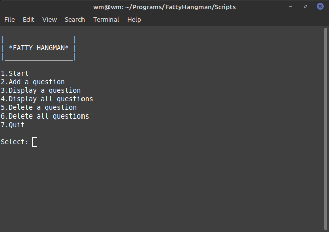

# CompanyManagement
Hello everyone!
I would like to introduce to you my own 'Fatty Hangman' project. I wrote this for four days and I think the code is really bad especially in Hangman.cpp. But I keep it because the main reason for writing this project was to learn how to manage a JSON file. I also have learnt how to make exceptions and getline input. In the game can manage questions from the program (add/del/disp category and answer) and have fun with the gameplay. More informations and images you can see below:

*GAMEPLAY*
--------------------------------------------------------------------------------------------------------------------
- Starting game

--------------------------------------------------------------------------------------------------------------------
- Writing letters and some mistakes

--------------------------------------------------------------------------------------------------------------------
- Winning the game by writing correct letters

--------------------------------------------------------------------------------------------------------------------
- Lose the game

--------------------------------------------------------------------------------------------------------------------
- Winning the game by writing correct answer

--------------------------------------------------------------------------------------------------------------------

*MENU*

--------------------------------------------------------------------------------------------------------------------

*ADD QUESTION*

--------------------------------------------------------------------------------------------------------------------

*DISPLAY A QUESTION*

--------------------------------------------------------------------------------------------------------------------
*DISPLAY ALL QUESTIONS*

--------------------------------------------------------------------------------------------------------------------

*DELETE A/ALL QUESTION/S*

--------------------------------------------------------------------------------------------------------------------

